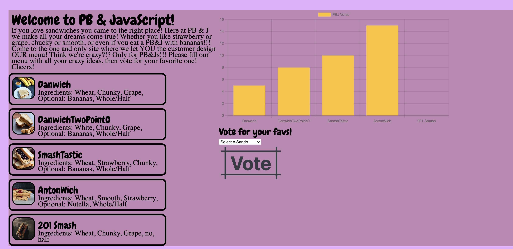
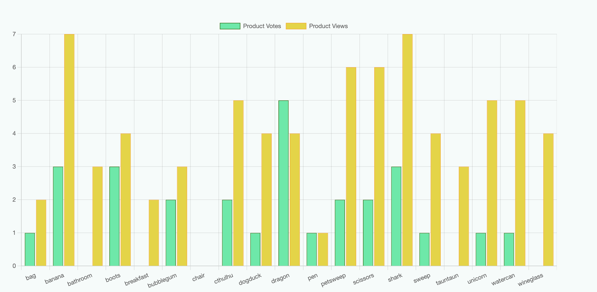

# portfolio-prep

## Experienced Professional

## My Background

My professional background is filled with a diverse array of experiences that range from military service, government contracting as a geolocation intelligence analyst, course instruction as a subject matter expert in mission management and most recently entrepreneurship.

## Tech Appeal

I'm drawn to tech because of the constant innovation factor that will continue to challenge me as I progress through my career. Innovation requires a blend of knowledge and creativity both of which are things that I value cultivating in my work and life.

## Peanut Butter & JavaScript Project

## Odd Ducks Project

